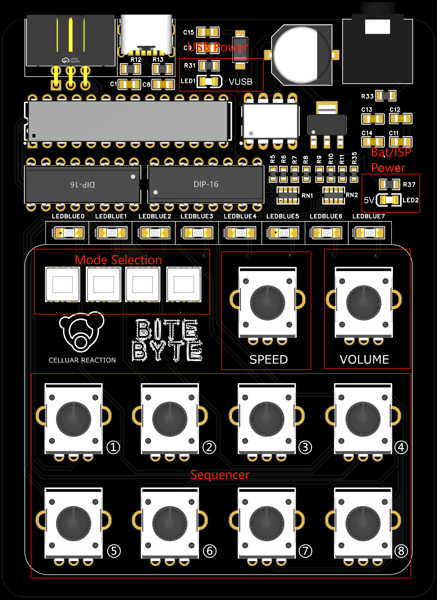

# BiteByte User Guidance

## Introduction

**BiteByte** is an 8bits synthesizer based on the Bytebeat Music Principle. It is also an 8 note sequencer that can adjust notes’ pitch by 8 potentiometers. With 4 self-locking switches, you can select 16 different Bytebeat tones. BiteByte is a sequencer, but unlike tranditional sequencer, this little instrument generates sequences only by operating one “Byte” wave. You can refer to the bytebeat coding method in The Tuesday Night Machines’ handbook - [The absolute beginner’s guide to coding Bytebeats!](https://github.com/TuesdayNightMachines/Bytebeats) 

The hardware design of BiteByte is pretty simple. It use an Atmega328P as the core MCU, and 74HC595 to output ByteBeat signal. A R2R DAC converts parallel data into voltage, and the detials can be found in this [project](https://github.com/ScottBillingsley/ByteBeats-on-arduino/tree/main). The control interface is designed with a 74HC4051. With an ISP port, you can easily update your own Bytebeat by AVR progamming workflow. 

BiteByte can be powered directly by usb, and it also has a battery selection. You can solder a 9V battery holder, or for convenience, you can use two 3V bottun batteries connected in series.

**Please notice that the audio volume is just controlled by one amplifer, so it’s better to adjust the volume carefully!**

## Interface Layout

## Sequencer Operation

### Basic Setup

You can play BiteByte whatever you want, but I think some basic setup tricks maybe helpful.

The blue Leds are design to help visulize the working state of the byte wave, you can easily check whether there’ s a wave output.

The suggested operating setup are:

> - Turn the Volume Knob to the end of left and this will mute the audio.
> - Turn the Speed Knob in a middle position, and you will get a moderate speed to start.
> - Turn All note knobs to the end of left, this will mute all notes, and you will see the blue led on the right blinking.
> - Let all mode buttons off, this mode output the basic waveform.

After seting up, you can try to turn first sequence knob, and the blue leds will change their blinking style. Then you can turn the volume knob on ( not too fast ) to listen the sound.

### Mode Selections

There are 4 switch buttons to select different wave mode. So you can load 16 different bytebeat waves. Thinking the buttons’s states are “0” and “1”, the black one (left) is low bit, you can select waves according to different binary like “0101”. 

I just put different bytebeat code in those mode, but not all code sound good in same sequence setup. It needs more exploring. But I have some recommend modes that sounds good.

> - “1000”: a classical FC sound.
> - “1010”: a triangle style sound.
> - “1001”: a cool mental like sound.
> - “0110”: a Trilling sound.
> - “1110”: a clean sawtooth sound maybe.
> - “0001”: a lofi phase sound.
> - “0111”: a robot sound.
> - ……

## Build Your Own BiteByte

### Hardware

Gerber and Semantic files can be found in the file folders. If you want to build your own pcb board, feel free to use those files. I guess the total cost of one board is about 20-30RMB.

### Software

You need a ISP uploader to burn your own code. The prepared port on the BiteByte is a 6pin ISP. If you don’t want to buy a specific uploader, I suggest to use an Arduino Board like Nano or Uno as ISP. There are a lot of resources can be found in the internet. The .hex file can be found in “Compile” folder.